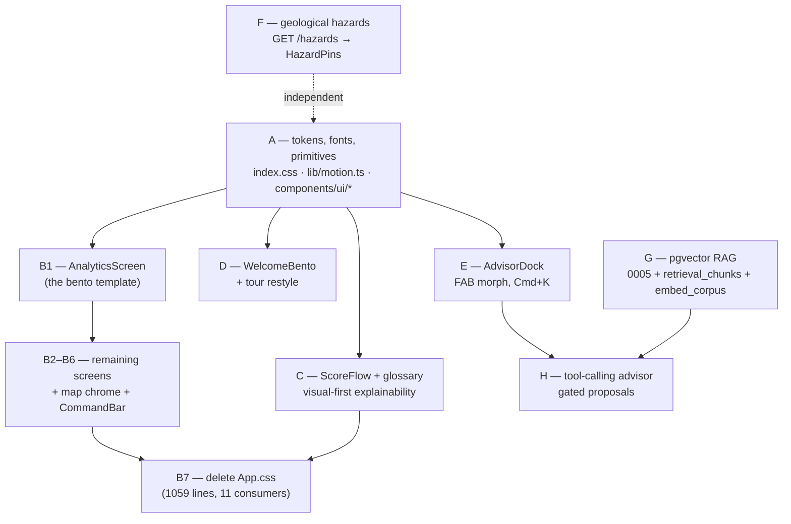
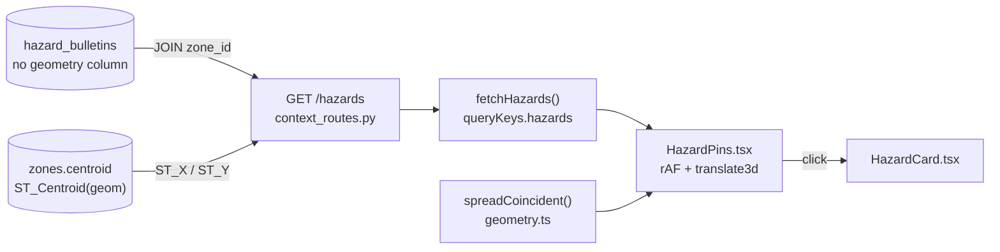
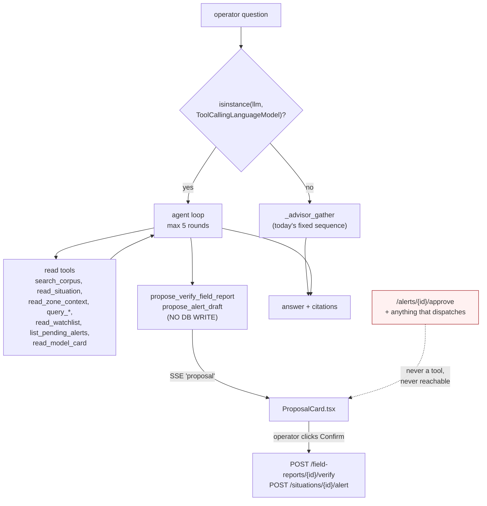

# Implementation plan — Apple-grade re-skin, visual explainability, geological hazards, and a real advisor

**Audience:** an autonomous coding agent. You cannot ask follow-up questions. Everything needed to
decide is in this document or in the files it names.

**Base commit:** `4733444` (*feat(web): situation-room polish — map status, advisor, evidence, and
screen redesign*). All line numbers below are accurate at that commit and **will drift as you edit** —
treat them as "look near here", and locate code by the quoted symbol or string, never by line alone.

**All paths are repo-relative.**

---

## 0. Read before you start

Non-negotiable reading, in order:

1. `README.md` — architecture and the process inventory.
2. `CLAUDE.md` — repo conventions. The four that will silently break your work are restated in §1.
3. `DEVIATIONS.md` — 20 deliberate departures from spec. D-017 (light-Carbon frontend) and D-020
   (advisor scoped down) are the two this plan reverses.
4. `improvements.md` — the source backlog. **§0–§4 are already implemented.** Do not rebuild them.

### Already done — do not rebuild

| Backlog item | Where it already lives |
|---|---|
| §0 Twilio migration | `packages/dira_dispatch/twilio_adapter.py`; `dispatch_mode: mock\|twilio` in `apps/worker/dira_worker/settings.py`; webhooks `/webhooks/twilio/{voice,gather,status}`. No Africa's Talking code exists anywhere. |
| §1 Forecast window | Migration `0003_forecast_window_advisor.py` adds `assessments.horizon_dekads / window_start / window_end` (+ window columns on `alerts`); exposed by `v_map_situations`; rendered via `fmtForecastWindow()` in `apps/web/src/lib/format.ts` by `ZoneCard`, `SituationDetailScreen`, `DispatchScreen`. **The column is `horizon_dekads`, not `horizon_days`.** |
| §2 Model card UI | `apps/web/src/screens/ModelScreen.tsx` + `GET /model/card`. |
| §3 ML foresight | `packages/dira_ml/.../train.py` labels `t+1..t+3` dekads, temporal split **with embargo**, `_assert_no_leakage`, three baselines, LightGBM activated only on proven held-out lift. |
| §4 Demo pulse | `scripts/demo_pulse.py` + `make pulse`. **Out of scope for this plan.** |
| §5.3 Map markers | `apps/web/src/features/map/SituationBadges.tsx` already replaced the "square with a dot": collision-resolved HTML badges carrying band, score, sparkline and delta. **Restyle its chrome only.** |
| §5.4 / §6 Advisor | Already streams (`POST /advisor/stream`), is multi-turn (`advisor_conversations` / `advisor_messages`), runs six named retrieval queries, and returns citations. Missing: vector retrieval, model-driven tool calling, a decent container. |

### What this plan delivers

1. **Workstreams A–B** — a full Apple-style re-skin, replacing the IBM Carbon direction of D-017.
   Restrained and professional: near-black ink, one accent, bento grids, generous radii and
   whitespace. No gradients, no glassmorphism candy, no oversized playful radii. Reference points are
   Apple Newsroom and Apple Developer documentation, not a consumer marketing page.
2. **Workstream C** — visual-first explainability. The raw
   `v1_weighted_70_30_with_corroboration_bump: …` string stops being the primary explanation.
3. **Workstream D** — a bento welcome overlay on first visit, and the existing tour restyled.
4. **Workstream E** — the advisor moves out of a generic `Sheet` into a purpose-built dock.
5. **Workstream F** — geological hazards on the map. Data and CHECK constraint already exist; nothing
   exposes them geographically.
6. **Workstream G** — pgvector RAG. `news_documents.embedding vector(1024)` is declared, written by
   nothing, queried by nothing, and unindexed.
7. **Workstream H** — a real tool-calling advisor with gated proposals that never bypasses the human
   approve/dispatch gate.

### Fixed decisions — do not revisit

- Apple re-skin, professional register. Light theme only; **no dark mode**.
- Typefaces: **Inter** (UI, headings, body) and **JetBrains Mono** (metrics, ids, cycles,
  coordinates). Remove `IBM Plex Sans`, `IBM Plex Sans Condensed`, `IBM Plex Mono`, `Source Serif 4`.
- Band and IPC palettes are **byte-identical** before and after. They are data semantics, not style.
- **Tailwind Preflight stays disabled.** Do not enable it.
- Onboarding = bento welcome overlay on first visit → the existing spotlight tour, restyled.
- pgvector: build it, **widen the corpus**, **HNSW** index, deterministic SQL retrieval stays primary.
- Scaling `scripts/demo_pulse.py` is out of scope.

---

## 1. Invariants — violating any of these breaks the build or the safety model

**Styling (from `CLAUDE.md`):**

- **Variable class names must come from an explicit `Record<K, string>` of full literal class names.**
  Tailwind's scanner cannot see `` `col-span-${n}` `` or `` `bg-band-${band}` ``; the class is simply
  never generated, with no build error. `apps/web/src/components/ui/Chips.tsx` is the reference.
- **Always write `border border-line`, never a bare `border`.** Preflight is off, so there is no
  default border colour.
- **Layer order in `apps/web/src/index.css` is `theme, base, vendor, components, utilities`,** and
  `maplibre-gl.css` must be imported *into* a layer. Unlayered CSS beats every layered rule regardless
  of specificity — an unlayered `.maplibregl-map { position: relative }` collapses the map container to
  zero height.
- Import `motion/react`, **never** `framer-motion`.
- The React Compiler is enabled: do not write refs during render, and do not rely on a `useMemo` whose
  body does not read all its declared deps. Imperative cache reads belong in effects.

**Tests that guard the above — read them before editing what they watch:**

| Test | What it enforces |
|---|---|
| `apps/web/src/lib/tokens.test.ts` | Regex-reads `index.css` for `--<token>: #hex;` and compares against `lib/format.ts`. Band and IPC tokens must remain **hex literals** — no `oklch()`, no `color-mix()`, no `var()` indirection. It also asserts the layer-order line and the maplibre `@import` line **character-exactly**. Do not reformat either line. |
| `apps/web/src/features/tour/tourSteps.test.ts` | Greps all of `src/` for the literal string `data-tour={TOUR_ANCHORS.<key>}`. A spread, a variable, or a string literal fails. Every anchor a step points at must be written in exactly that form. |
| `apps/web/src/features/map/overlayFillColor.test.ts` | Overlay paint expressions against `BAND_MAP_COLORS` / `IPC_COLORS` / `CHART`. Unchanged by design. |
| `apps/web/src/features/map/geometry.test.ts` | Pure, no DOM. Workstream F adds cases here. |
| `apps/web/src/features/advisor/markish.test.ts` | Untouched. A failure means the streaming render path was disturbed. |
| `apps/web/src/lib/ssePatch.test.ts` | Untouched. Guards the SSE → query-invalidation map. |

**Frontend test runner constraint:** `apps/web/vite.config.ts` sets `environment: 'node'` and
`include: ['src/**/*.test.ts']`. New tests must be **`.ts`** (not `.tsx`) and **DOM-free**. jsdom and
Testing Library are in `devDependencies` but are not wired up. Adding component-render tests is
explicitly out of scope — do not change the test config.

**Domain red lines (from `CLAUDE.md` and `DEVIATIONS.md`):**

- **Bitemporality.** Every read of source data filters `available_at <= <cutoff>`. Nothing may surface
  before it was knowable. `/map/events` in `apps/api/dira_api/context_routes.py` is the reference.
- **Unverified field reports contribute exactly 0 corroboration.** Always.
- **The combination rule is a plain string persisted on every assessment.** It must remain reachable
  verbatim in the UI (Workstream C moves it behind a disclosure; it does not remove it).
- **No network calls inside an open DB transaction.** A hard rule throughout the codebase.
- **The human gate is a DB `CHECK` on `alerts`.** The advisor must never gain a path to approve or
  dispatch — see Workstream H's red lines, which are test-enforced.
- `packages/dira_core` imports **nothing** from sibling packages. `importlinter.ini` fails the build
  otherwise.
- `DATA_MODE=seeded` must stay **deterministic and network-free**.

---

## 2. Order of work



Recommended sequence: **A → B1 → B2–B6 → F → C → D → E → B7 → G → H.**

`F` is self-contained and can land any time after `A`. `G` must precede `H4`. `B7` is last on the
frontend because eleven files still read `App.css`.

**Run the gate (§10) after every workstream, not only at the end.** Commit per workstream with a
conventional-commit subject so a bisect lands on one concern.

---

## 3. Workstream A — design system

**Read first:** `apps/web/src/index.css`, `apps/web/src/lib/motion.ts`, `apps/web/src/lib/format.ts`,
`apps/web/src/lib/tokens.test.ts`, `apps/web/src/components/ui/index.ts`.

### A1. `apps/web/index.html`

Replace the single Google Fonts `<link>`; keep both `preconnect` tags.

```html
<link
  href="https://fonts.googleapis.com/css2?family=Inter:opsz,wght@14..32,400;14..32,500;14..32,600;14..32,700&family=JetBrains+Mono:wght@400;500;600&display=swap"
  rel="stylesheet"
/>
```

Add `<meta name="theme-color" content="#f5f5f7" />` and a `<meta name="description">`. Both are absent
today.

### A2. `apps/web/src/index.css` — the `@theme` block

**Keep verbatim:** the layer-order line, all four `@import … layer(…)` lines, the Preflight-disabled
header comment, every `@keyframes`, every `--z-*` and `--animate-*` token, and the `:root` legacy
bridge block (load-bearing for `App.css` until B7).

```css
/* Surfaces and ink */
--color-canvas: #f5f5f7;        /* was #f4f4f4 */
--color-surface: #ffffff;
--color-surface-2: #fbfbfd;     /* was #fafafa */
--color-surface-3: #f0f0f3;     /* was #f1f3f5 */
--color-line: #e5e5ea;          /* was #e8e8e8 — iOS separator */
--color-line-strong: #c7c7cc;   /* was #c6c6c6 */
--color-ink: #0a0a0a;           /* was #161616 */
--color-muted: #3a3a3c;         /* was #525252 */
--color-faint: #6e6e73;         /* was #6f6f6f — 4.9:1 on white, still AA */

--color-accent: #0071e3;        /* was #0f62fe */
--color-accent-hover: #0058b0;
--color-accent-soft: #eaf2fe;
--color-accent-ring: #cfe3fb;
--color-accent-deep: #003d82;
```

Band, IPC and status-pair tokens: **unchanged, character for character.**

Type — delete `--font-condensed` and `--font-display` entirely:

```css
--font-sans: 'Inter', -apple-system, BlinkMacSystemFont, 'Segoe UI', system-ui, sans-serif;
--font-mono: 'JetBrains Mono', ui-monospace, SFMono-Regular, monospace;
```

Size ramp — body density is preserved at a 14px base; headings grow and tighten. That contrast between
a dense body and a large, tightly-tracked heading is the Apple signature:

```css
--text-2xs: 0.6875rem;  --text-2xs--line-height: 1rem;
--text-xs:  0.75rem;    --text-xs--line-height:  1.125rem;
--text-sm:  0.8125rem;  --text-sm--line-height:  1.25rem;
--text-base:0.875rem;   --text-base--line-height:1.5rem;    /* was 1.375 — more air */
--text-md:  0.9375rem;  --text-md--line-height:  1.5625rem;
--text-lg:  1.0625rem;  --text-lg--line-height:  1.5rem;
--text-xl:  1.375rem;   --text-xl--line-height:  1.75rem;   --text-xl--letter-spacing: -0.015em;
--text-2xl: 1.75rem;    --text-2xl--line-height: 2.125rem;  --text-2xl--letter-spacing: -0.02em;
--text-3xl: 2.5rem;     --text-3xl--line-height: 2.75rem;   --text-3xl--letter-spacing: -0.022em;
--text-4xl: 3.25rem;    --text-4xl--line-height: 3.5rem;    --text-4xl--letter-spacing: -0.024em;

--text-eyebrow: 0.6875rem;
--text-eyebrow--line-height: 1rem;
--text-eyebrow--letter-spacing: 0.06em;   /* was 0.12em — quieter than Carbon's */
--text-eyebrow--font-weight: 600;

--text-metric: 2rem;    --text-metric--line-height: 1; --text-metric--letter-spacing: -0.02em;
```

```css
--radius-xs: 4px;  --radius-sm: 6px;  --radius-md: 10px;
--radius-lg: 14px; --radius-xl: 18px; --radius-2xl: 24px;
--radius-bento: 20px;

--shadow-sm:    0 1px 2px rgba(0, 0, 0, 0.04);
--shadow-md:    0 4px 16px rgba(0, 0, 0, 0.06);
--shadow-lg:    0 12px 40px rgba(0, 0, 0, 0.10);
--shadow-panel: 0 0 0 0.5px rgba(0, 0, 0, 0.06), 0 8px 28px rgba(0, 0, 0, 0.08);
--shadow-bento: 0 1px 3px rgba(0, 0, 0, 0.04), 0 8px 24px -8px rgba(0, 0, 0, 0.10);

--ease-standard: cubic-bezier(0.4, 0, 0.2, 1);
--ease-entrance: cubic-bezier(0.16, 1, 0.3, 1);   /* ease-out-expo, the "Apple" ease */
--ease-exit:     cubic-bezier(0.4, 0, 1, 1);
```

Add to the existing `body` rule inside `@layer base`:

```css
font-feature-settings: 'tnum' 1, 'cv05' 1, 'ss01' 1;
```

### A2b. `apps/web/src/lib/motion.ts` — same commit as A2

This file hand-mirrors the `--ease-*` tokens and **nothing tests the pair**, so it drifts silently. If
you skip this, every `motion` component keeps animating on Carbon curves while CSS transitions use
Apple ones.

```ts
export const EASE = {
  standard: [0.4, 0, 0.2, 1],
  entrance: [0.16, 1, 0.3, 1],
  exit: [0.4, 0, 1, 1],
} as const
```

Also retune `T.panel` and `T.spotlight` to `{ type: 'spring', stiffness: 380, damping: 32 }` — the
springs Workstreams D and E rely on. Keep the file's house rules comment: springs are for panels and
the spotlight only; anything encoding data animates on duration + ease, never with overshoot.

### A3. Retire `font-condensed` and `font-display`

```bash
rg -n "font-condensed|font-display" apps/web/src
```

37 matching lines; two are the token declarations in `index.css`, leaving **35 call sites**.
`apps/web/src/components/ui/Card.tsx` holds five of them, and those five cover every `Card`,
`PageHeader`, `SectionHeader` and `Section` title in the app — fix that file and most of the screen
surface follows.

| Old pattern | Replacement |
|---|---|
| `font-condensed text-2xs font-semibold tracking-[0.09em] text-muted uppercase` | `text-eyebrow text-faint uppercase` |
| `font-condensed text-sm font-semibold tracking-[0.05em] text-ink uppercase` (card titles) | `text-md font-semibold tracking-[-0.01em] text-ink` — **sentence case** |
| `font-condensed text-2xl font-bold tracking-[0.01em] text-ink uppercase` (`PageHeader`) | `text-3xl font-semibold text-ink` — **sentence case** |
| `font-display` — only two sites, in `ModelScreen.tsx` and `SituationDetailScreen.tsx` | `font-sans text-xl font-semibold tracking-[-0.02em] text-ink` |

**Rule: titles become sentence-case Inter Semibold with negative tracking. Only small eyebrow labels
keep uppercase.** Uppercase headings are the single most "IBM" thing on the screen and all of them must
go.

The eyebrow class string above appears **verbatim in five or more places** (`Stat.tsx`, `Field.tsx`,
`DataTable.tsx`, `AnalyticsScreen.tsx`, `ZonesScreen.tsx`). Add an `Eyebrow` primitive to
`components/ui/Card.tsx`, export it from the barrel, and use it at every one of those sites, so the
next type change is a one-file edit.

### A4. New primitive — `apps/web/src/components/ui/Bento.tsx`

```tsx
export function BentoGrid({
  children, className,
}: { children: ReactNode; className?: string }): ReactElement
// grid grid-cols-2 gap-3 md:grid-cols-4 lg:grid-cols-6 lg:gap-4

export type BentoSpan = 1 | 2 | 3 | 4 | 6
export type BentoTone = 'default' | 'quiet' | 'accent' | 'inverse'

export type BentoCardProps = {
  span?: BentoSpan
  rowSpan?: 1 | 2 | 3
  eyebrow?: ReactNode
  title?: ReactNode
  subtitle?: ReactNode
  actions?: ReactNode
  footer?: ReactNode
  tone?: BentoTone
  interactive?: boolean
  padded?: boolean
  className?: string
  children?: ReactNode
}
export function BentoCard(props: BentoCardProps): ReactElement
```

Span classes **must** come from explicit records of full literal names (see §1):

```tsx
const COL_SPAN: Record<BentoSpan, string> = {
  1: 'col-span-1',
  2: 'col-span-2',
  3: 'col-span-3',
  4: 'col-span-4',
  6: 'col-span-2 md:col-span-4 lg:col-span-6',
}
const ROW_SPAN: Record<1 | 2 | 3, string> = {
  1: 'row-span-1',
  2: 'row-span-2',
  3: 'row-span-3',
}
```

Base classes:

```
relative flex min-w-0 flex-col overflow-hidden rounded-bento border border-line bg-surface
shadow-bento transition-[transform,box-shadow] duration-200 ease-entrance
```

plus, when `interactive`: `hover:-translate-y-0.5 hover:shadow-lg cursor-pointer`.

`tone='inverse'` is `bg-ink text-white border-ink`. **Use it for exactly one hero tile per screen.**
One dark tile among white is what makes a bento grid read as designed rather than as a table. Two or
more and the effect collapses.

Export `BentoGrid`, `BentoCard`, `BentoSpan`, `BentoTone` from `components/ui/index.ts`.

### A5. Rework the existing primitives

All files are under 200 lines. Work through `apps/web/src/components/ui/` in this order.

- **`Card.tsx`** — `rounded-lg` → `rounded-bento`; `shadow-sm` → `shadow-bento`; the header row loses
  its `border-b` and `bg-surface-2/60` (Apple cards are one continuous surface — separate with space,
  not rules); padding `p-4` → `p-5`. `PageHeader`: drop the `border-b`, stack the eyebrow above a
  sentence-case `text-3xl` title, and move the description **below** the title at
  `text-md text-faint max-w-[62ch]` — today it sits beside it. `Section`: replace the
  hairline-through-the-title device with a plain `text-eyebrow` label plus `mb-4`. `Screen`:
  `px-6 pt-5 pb-12` → `px-6 pt-8 pb-16 lg:px-10`. Add and export `Eyebrow`.
- **`Button.tsx`** — `rounded-sm` → `rounded-full` for `primary` and `secondary` (the Apple pill),
  `rounded-md` for `ghost` and `IconButton`. Primary gains `active:scale-[0.98]` and
  `transition-[transform,background-color] duration-150`.
- **`Stat.tsx`** — metric in `font-mono text-metric tabular-nums`; label above it via `Eyebrow`.
  Replace the `border-t-[3px]` accent bar with a 2px accent rule inside the card. `rounded-bento`.
- **`DataTable.tsx`** — remove vertical rules entirely; row separator `border-line`; header row
  `text-eyebrow text-faint` in **sentence case, not caps**; row height +4px; `hover:bg-surface-2`;
  first and last cell padding `px-5`. Keep the client-side sort, the `secondary` column hiding below
  `lg`, and the inline `boxShadow: inset 3px 0 0 …` row accent.
- **`Chips.tsx`** — `rounded-full`, `text-2xs font-medium`. **Keep every band colour record exactly.**
- **`Field.tsx`** — controls become `rounded-md border-line bg-surface-2 focus:bg-surface
  focus:border-accent focus:ring-4 focus:ring-accent-ring/40`.
- **`Meter.tsx`** — `ScoreMeter` currently **hardcodes `#0f62fe` and `#d0e2ff`**, which makes it
  invisible to every token change. Point it at `var(--color-accent)` and `var(--color-accent-ring)`.
- **`Skeleton.tsx`** — `SkeletonCard` → `rounded-bento`. Fix `ScreenSkeleton`'s existing drift from
  `Screen` (`pt-6` vs the new `pt-8`) and from `StatRow` (`minmax(10.5rem,…)` vs `13rem`).
- **`Sparkline.tsx`, `Notes.tsx`, `Tabs.tsx`, `Tooltip.tsx`, `Kbd.tsx`** — radius and shadow token
  pass only.
- **`Sheet.tsx`** — token pass. It stays exported for other call sites but stops being the advisor's
  container (Workstream E).

**Done when:** the gate (§10) is green, `rg "font-condensed|font-display" apps/web/src` returns
nothing, and no `@theme` band or IPC token has changed.

---

## 4. Workstream B — bento layouts, screen by screen

**Read first:** `apps/web/src/components/charts.tsx`, `apps/web/src/lib/format.ts` (the `CHART`
palette), and the screen you are about to edit.

Pattern for every screen: **one large hero tile, several medium, a few small** — never a uniform grid
of equal cards. Exactly one `tone='inverse'` tile per screen. Charts keep the existing dataviz mark
spec (≤24px bars, 2px lines, hairline grids, official IPC colours, band colours reserved for band
semantics, never dual axes) and the `CHART` palette. **Only the containers change.**

### B1. `apps/web/src/screens/AnalyticsScreen.tsx` — do this one first, as the template

Currently: a four-up `StatRow`, a full-width lead combo chart, a 12-column grid (7 / 5 / 12), and a
trailing economy card. Becomes:

```
lg:grid-cols-6
[ Band distribution      span 4, row 2 ]  [ Zones at risk    span 2, INVERSE ]
                                          [ People in P3+    span 2 ]
[ Incidents by month     span 4, row 2 ]  [ Displacement     span 2, row 2 ]
[ Field report funnel span 2 ] [ Delivery health span 2 ] [ Climate by cluster span 2 ]
```

Keep the `EconomyPanel` card rendering **outside** the `data ?` guard, as it does today, so it still
shows while the rest loads.

### B2. `apps/web/src/screens/ZonesScreen.tsx`

The complaint being answered is *"the zones dashboard is just a list — too much text, too little
visuals."* Answer it by putting a visual summary **above** the table, not by deleting the table.

```
lg:grid-cols-6
[ Regional band strip (BandDistributionBar, large)             span 4 ]
[ Zones needing attention now — count + names        span 2, INVERSE ]
[ Top 6 zone mini-cards: name, BandDot, big mono score, Sparkline  span 6 ]
[ Filter bar (today's fused bar, now a BentoCard)               span 6 ]
[ DataTable inside a padded={false} BentoCard                   span 6 ]
```

The six mini-cards are the new visual layer. Reuse `Sparkline`, `BandDot` and `Meter` — **do not invent
new chart components.** Keep the interactive `BandDistributionBar` doubling as the band filter.

### B3. `apps/web/src/screens/MapScreen.tsx` and the map chrome

The map stays full-bleed (`absolute inset-0`). It is **not** bento'd. Its floating chrome becomes:

- **`features/map/WatchlistRail.tsx`** — `rounded-bento shadow-panel border-line`,
  `bg-surface/92 backdrop-blur-xl`, more vertical room per row, right-aligned mono score. Keep
  `data-tour={TOUR_ANCHORS.mapWatchlist}` and the `data-zone-row` scroll-into-view hook.
- **`features/map/ZoneCard.tsx`** — `rounded-bento`, restructured as an **internal 2-column bento**:
  guidance sentence full width, then `[score + Meter] [trend Sparkline]`, then
  `[forecast window] [corroboration]`, then actions. Keep `fmtForecastWindow` and the `toAssessment()`
  adapter exactly as they are, and keep `data-tour={TOUR_ANCHORS.mapZoneCard}`.
- **`features/map/MapStatusStrip.tsx`, `MapLegend.tsx`, `MapToolbar.tsx`** — pill-shaped floating
  controls: `rounded-full bg-surface/92 backdrop-blur-xl shadow-panel border border-line`. Keep
  `data-tour={TOUR_ANCHORS.mapOverlays}` on the toolbar.
- **`features/map/SituationBadges.tsx`** — **chrome only.** `rounded-md` → `rounded-xl`,
  `shadow-panel` → `shadow-lg`, `bg-surface/95` → `bg-surface/92 backdrop-blur-xl`, and the 3px band
  bar becomes a 2.5px `rounded-l-xl` strip.

  **Do not touch:** the collision-resolution loop, the `requestAnimationFrame` `reposition`/`schedule`
  pair, the `node.style.transform = translate3d(…)` direct DOM write, `BADGE_W`, `BADGE_H`,
  `PIP_ONLY_ZOOM`, or the `moveend` tick that re-runs collision against the new projection. That logic
  is correct and expensive to get right. It is also the pattern Workstream F copies.
- **`features/map/basemap.ts`** — `tuneBasemap()` sets the land colour through the **`background`**
  layer (`setPaintIfPresent(map, id, 'background-color', '#fafafa')`), not a land-fill rule. Change it
  to `#f5f5f7` so the basemap matches `--color-canvas`. One-line paint change; keep
  `setPaintIfPresent` and the raster fallback path intact.
- **Pre-existing bug to fix while here:** `features/map/useSelectedZone.ts` omits `'markets'` from its
  `OVERLAYS` array, so `?overlay=markets` does not survive a reload — even though `MapToolbar`,
  `MapLegend` and `overlayFillColor` all support it.

### B4. `apps/web/src/screens/SituationDetailScreen.tsx`

```
lg:grid-cols-6
[ Verdict hero: band, guidance sentence, forecast window   span 4, INVERSE ]
[ ScoreFlow (Workstream C)                                 span 2, row 2 ]
[ ShapDrivers                                              span 4 ]
[ Assessment history chart span 4 ]  [ EvidenceBoard        span 2, row 2 ]
[ Actions / alert draft                                    span 4 ]
```

Keep `data-tour={TOUR_ANCHORS.twoScore}` and `data-tour={TOUR_ANCHORS.shapDrivers}` written **literally
in that form** (§1).

### B5. Remaining screens

`DispatchScreen.tsx`, `SourcesScreen.tsx`, `ModelScreen.tsx`, `ZoneDossierScreen.tsx`,
`SituationsScreen.tsx` — same treatment. `DispatchScreen` must keep
`data-tour={TOUR_ANCHORS.approvalGate}`.

For `ModelScreen`, **keep every honesty caveat string verbatim** — the metrics-in-context wording, the
`fallback_reason`, and the limitations list are the entire point of that screen. Layout:

```
[ what it predicts   span 2, INVERSE ] [ horizon span 2 ] [ how it was trained span 4 ]
[ metrics vs baselines span 4 ] [ what it does not claim span 2 ] [ limitations span 6 ]
```

### B6. Chrome — `layouts/CommandBar.tsx`, `BrandMark.tsx`, `StatusCluster.tsx`, `PressureRibbon.tsx`

Header `h-14`, `bg-surface/80 backdrop-blur-xl border-b border-line`; brand at
`text-md font-semibold tracking-[-0.02em]` in sentence case; nav items as pills with a `layoutId`
sliding active indicator. Keep the `G`-chord keyboard map defined in `layouts/navItems.ts`, and keep
`data-tour={TOUR_ANCHORS.brand}` and `data-tour={TOUR_ANCHORS.askDira}` untouched.

### B7. Retire `apps/web/src/App.css` — last frontend step

1059 lines with eleven consumers: `components/Modal.tsx`, `components/charts.tsx`,
`features/economy/EconomyPanel.tsx`, and all of `features/situations/` (`EvidenceBoard`,
`ConflictEvents`, `HazardBulletins`, `ScoreExplainer`, `SignalDetailModal`, `SignalsList`,
`ShapDrivers`, `FieldReportModal`).

`components/charts.tsx` is the highest-leverage one — Analytics, ZoneDossier and others all render
through it, so migrate it first.

Migrate each consumer to utilities, then delete, in one commit:
- `App.css` itself;
- its `@import './App.css' layer(components);` line in `index.css`;
- the `:root` legacy bridge block in `index.css`;
- the `@layer components` rule that restores UA list markers for `.feed-list, .drivers-list,
  .red-lines, .timeline` (those classes only exist in `App.css`).

Keep the maplibre `@import` line and the layer-order line byte-exact (§1). **Do not enable Preflight**
— the `@layer base` stand-in already covers the gaps, and flipping it is a separate risk with its own
blast radius.

**Done when:** the gate is green, `apps/web/src/App.css` does not exist, and `rg "App.css" apps/web`
returns nothing.

---

## 5. Workstream C — visual-first explainability

**Read first:** `apps/web/src/features/situations/ScoreExplainer.tsx`, `apps/web/src/lib/explain.ts`,
`apps/web/src/components/ui/Meter.tsx`.

### C1. `apps/web/src/features/situations/ScoreFlow.tsx` (new)

Replaces `ScoreExplainer.tsx`, which is today a `Modal` containing five numbered arithmetic steps
ending in the raw persisted rule string.

**Reuse, do not reimplement.** `apps/web/src/lib/explain.ts` already exports everything needed:
`parseCombination(rule, modelRisk, corroboration)` → `{ newsCorroboration, fieldCorroboration,
operationalScore, preBumpBand, bumped }`, plus `BAND_THRESHOLDS`, `BAND_TICKS` and `bandFromScore`.
Do not re-parse the rule string and do not restate the thresholds.

Render it **inline in the situation dossier**, not only in a modal.

```
  Forecast from climate + conflict history
  ████████████░░░░░░  67          ╲
                                    ╲ 70%
                                     ▶  69  ──▶  ┌──────────┐
                                    ╱ 30%        │   HIGH   │
  What people are reporting                      └──────────┘
  ██████████████░░░░  72          ╱               ▲ raised one step
   news 72 · verified reports 70                    because reports agree
```

Implementation rules:

- Two horizontal `Meter` bars, animated in on mount with `motion/react` (`ease-entrance`, 400ms, 80ms
  stagger). Bar 1 uses `CHART.cat1`, bar 2 uses `CHART.cat2`.
- The weighting is two converging strokes in an inline `<svg>`, with **stroke widths literally
  proportional to 0.7 and 0.3.** The geometry *is* the explanation — that is the whole point of this
  component.
- The band ladder is a vertical rail of five rungs coloured from `BAND_COLORS`; the operational score
  lands on its rung with a spring. When `bumped`, an arrow animates one rung up, captioned
  "raised one step — strong on-the-ground confirmation".
- **Guard `newsCorroboration` and `fieldCorroboration` for `null`.** They are typed `number | null` and
  `ScoreExplainer` passes them unguarded into `ScoreMeter` and `fmtRisk` today; `ZoneCard` does guard
  them. Follow `ZoneCard`.
- **Banned from the visible surface:** "corroboration", "operational score", "combination rule",
  "dekad", "bitemporal", "frozen snapshot", "news signals", "SHAP". Use instead: "what people are
  reporting", "combined score", "how the score is worked out", "10-day period", "what we knew at the
  time", "reports in the news", "what pushed the score".
- Beneath it, a `<details>` disclosure labelled **"Show the exact stored rule"** containing
  `assessment.combination_rule` verbatim in `font-mono text-xs`. The no-black-box guarantee is
  preserved — it is simply no longer the first thing an operator reads.

`ZoneCard.tsx` opens `ScoreExplainer` today; repoint it at `ScoreFlow` inside a `Modal`.

### C2. `apps/web/src/lib/glossary.ts` (new)

```ts
export type GlossaryEntry = { plain: string; technical: string; explanation: string }
export const GLOSSARY: Record<string, GlossaryEntry>
export function glossaryEntry(key: string): GlossaryEntry | null
```

Cover the banned terms from C1. Add a small `<Term term="corroboration">what people are reporting</Term>`
wrapper built on the **existing** `InfoHint` primitive in `apps/web/src/components/ui/Tooltip.tsx` —
do not write a new tooltip. Apply it in `ScoreFlow`, `ZoneCard`, `EvidenceBoard` and `SourcesScreen`.

The three existing `InfoHint` call sites with hardcoded prose (`SourcesScreen.tsx`, and two in
`ModelScreen.tsx`) should source their content from the glossary instead.

### C3. Copy sweep

```bash
rg -n "corroboration|dekad|SHAP|signal|snapshot" apps/web/src --glob '*.tsx'
```

Replace user-visible strings per the table in C1. **Do not rename TypeScript fields, API keys, JSON
properties, or DB columns.** This step is copy only — renaming any of those breaks the API contract.

**Done when:** the gate is green, and none of the banned terms appears in a user-visible string in
`apps/web/src/features/situations/` or `screens/`.

---

## 6. Workstream D — onboarding

**Read first:** `apps/web/src/features/tour/tourSteps.ts`, `tourAnchors.ts`, `GuidedTour.tsx`,
`CoachMark.tsx`, `Spotlight.tsx`, `apps/web/src/lib/anchor.ts`, `apps/web/src/layouts/AppLayout.tsx`.

### D1. `apps/web/src/features/onboarding/WelcomeBento.tsx` (new)

A full-screen overlay on a genuine first visit only. Persist dismissal under the `localStorage` key
`dira-welcome-v1`, mirroring the `readTourProgress` / `writeTourProgress` helpers in `tourSteps.ts`
(including their try/catch — storage is unavailable in private mode and the app must still work).

Backdrop `bg-canvas/80 backdrop-blur-2xl`; content `max-w-[1100px]`; staggered tile entrance
(`ease-entrance`, 60ms per tile).

Six tiles, plain language, each with a real small visual — no lorem, no bare stock icons:

| Tile | Span | Content |
|---|---|---|
| What Dira does | 2×2, **INVERSE** | One sentence plus a looping mini-map SVG where three zones fade up to warm colours |
| A zone | 1×1 | A single zone-card thumbnail |
| The score | 1×1 | The two-bar `ScoreFlow` at miniature scale |
| From a signal to a phone call | 2×1 | Five-step horizontal flow: data → forecast → check → **a person approves** → voice call |
| Where the data comes from | 1×1 | Logos-as-text: ACLED, CHIRPS, IPC, DTM, WFP, WHO |
| What it will not do | 1×1 | "It never names groups. It never sends anything on its own." |

Footer: `[ Take a look → ]` dismisses and starts the tour at step 0; `[ Skip ]` dismisses only.

### D2. Rebuild the tour's visual layer

**Keep unchanged:** `tourSteps.ts` (the nine steps and their copy are good), `tourAnchors.ts`, every
`data-tour={TOUR_ANCHORS.<key>}` attribute, `lib/anchor.ts`, `useAnchorRect.ts`, `waitForAnchor.ts`,
route navigation, `precondition` / `resolveRoute`, and `tourSteps.test.ts`.

**Rewrite the presentation only:**

- **`CoachMark.tsx`** → `rounded-bento`, `min-w-[320px]`, `shadow-lg`, sentence-case
  `text-xl font-semibold tracking-[-0.02em]` title, `text-md text-muted` body, a segmented progress
  rail at the bottom, chapter name as `text-eyebrow`. Keep `useFocusTrap`,
  `role="dialog" aria-modal="true"`, and the jump-back-only `role="tablist"` rail semantics
  (`disabled={position > index}`).
- **`Spotlight.tsx`** → cut-out corner radius `8` → `18`, and a 300ms `ease-entrance` transition
  between anchors instead of a hard jump. **Keep the SVG-mask approach and its rationale comment** —
  `box-shadow: 0 0 0 9999px` cannot animate shape or radius and clips at viewport edges, and
  `clip-path` animates inconsistently across browsers. Keep `Blockers` as a separate component so
  `interactive` steps can skip it while looking identical.
- `readTourProgress` never checks the stored `v` field. Since the chrome changes, bump
  `TOUR_STORAGE_KEY` to `dira-tour-v3` (or add an explicit version guard) so a stale v2 entry cannot
  resume into the new presentation mid-way.

Wire `WelcomeBento` and `GuidedTour` together in `layouts/AppLayout.tsx`, where `tourOpen` is managed
today. Welcome shows first; `?tour=1` and the `?` key still force the tour directly, bypassing welcome.

**Done when:** the gate is green; `localStorage.clear()` → reload shows welcome; "Take a look"
completes all nine tour steps across `/`, `/situations/:id` and `/dispatch` with no skipped anchor.

---

## 7. Workstream E — advisor presentation

**Read first:** `apps/web/src/features/advisor/AskAdvisor.tsx`, `advisorStore.ts`,
`apps/web/src/layouts/AppLayout.tsx`, `apps/web/src/components/ui/Sheet.tsx`.

The problem is the container, not the content: `AskAdvisor` is mounted in a generic `Sheet` in
`AppLayout.tsx`.

- **New `apps/web/src/features/advisor/AdvisorDock.tsx`** — a pill FAB
  (`rounded-full bg-ink text-white shadow-lg`, sparkle icon plus "Ask Dira") that **morphs** into the
  panel via a shared `layoutId` in `motion/react`. That morph is the single detail that makes the
  feature feel intentional rather than a square appearing.
- Panel: `fixed right-4 bottom-4 top-20 w-[26rem] rounded-bento border border-line bg-surface/92
  backdrop-blur-xl shadow-lg`, entering on `{ type: 'spring', stiffness: 380, damping: 32 }`, exiting
  as a fade plus an 8px drop. Add an expand control that widens it to `w-[44rem]`.
- **Corner collision — handle this explicitly.** `ZoneCard` already occupies `top-3 right-3` at
  `z-map-panel` (21). Mount the dock at `z-drawer` (45), and on the map route only, shift the FAB clear
  of the zone card (or offset the panel) so the two never overlap. The `--z-*` scale is defined in
  `index.css`.
- `Cmd/Ctrl+K` toggles the dock. Register it alongside the `G`-chord handler in `AppLayout.tsx`. That
  handler currently returns early on `event.metaKey || event.ctrlKey || event.altKey`, so **the ⌘K
  branch must be checked before that guard** — while still respecting the existing "never steal a
  keystroke from a focused field" check for `contentEditable` / `INPUT` / `TEXTAREA` / `SELECT`.
- Inside `AskAdvisor.tsx`, **keep untouched:** the streaming logic, `advisorStore`, the retrieval trace
  list, and the local `Citations` function near the bottom of the file (it is a private function, not a
  module). Restyle only:
  - user turns → `rounded-2xl bg-accent-soft` bubbles aligned right;
  - assistant turns → lose the border, plain text on the surface, keeping the existing thin
    band-coloured left rule;
  - composer → `rounded-xl` with the send button inside it.
- A dock that survives navigation should be able to cancel an in-flight answer. `streamAdvisor` in
  `lib/api.ts` already accepts `options.signal`, but no caller supplies one — wire an
  `AbortController`.
- **Keep the `Read-only · cannot approve or dispatch` footer line** and the duplicate claim in the
  Sheet/dock subtitle. Both must survive into H5, which revises the wording rather than removing it.
- `Sheet.tsx` stays exported for other call sites.

**Done when:** the gate is green; ⌘K opens the dock with the morph animation; the dock does not overlap
the zone card on the map route; typing ⌘K inside the composer does not close the dock unexpectedly.

---

## 8. Workstream F — geological hazards on the map

**Read first:** `apps/api/dira_api/context_routes.py` (the `/map/events` route and `SOURCE_CATALOG`),
`apps/web/src/features/map/SituationBadges.tsx`, `apps/web/src/features/map/geometry.ts`,
`apps/web/src/lib/explain.ts` (`HAZARD_META`, `HAZARD_SEVERITY_META`),
`apps/web/src/features/situations/HazardBulletins.tsx` (`HAZARD_ICONS`).

The data already exists end to end: `hazard_bulletins` (migration `0002_information_layer.py`), the
CHECK widened to include `earthquake | volcanic | landslide` by `0004_geological_hazards.py`, and three
seeded rows from `scripts/generate_igad_fixtures.py` — `afar_triangle` / volcanic / watch,
`afar_coast` / earthquake / advisory, `blue_nile_escarpment` / landslide / watch, all with
`source='usgs_seeded'` and a `valid_to` in the future relative to the seeded cycle.

Today they surface only in `GET /zones/{id}/profile` and as the scalar `active_hazards` count in
`v_zone_context`. **Nothing draws hazard points.**



### F1. Backend — `apps/api/dira_api/context_routes.py`

New route returning a GeoJSON `FeatureCollection`. **Mirror the `/map/events` route** — it is the house
pattern for a point layer, including the `window` foreign member and a hard `LIMIT`.

```python
@router.get("/hazards")
def list_hazards(
    hazard_type: str | None = None,
    include_expired: bool = False,
) -> dict[str, Any]:
```

- Geometry: `json_build_array(round(ST_X(z.centroid)::numeric, 4), round(ST_Y(z.centroid)::numeric, 4))`.
  `hazard_bulletins` has **no geometry column** and does not need one — join
  `zones z ON z.id = hb.zone_id`. `zones.centroid` is nullable in DDL but always populated at seed time
  (`scripts/bootstrap.py` inserts `ST_Centroid(geom)`); `ST_X(z.centroid) AS lon` is already used
  elsewhere in this file.
- Properties: `id, zone_id, zone_name, country_iso2, hazard_type, severity, headline, detail,
  valid_from, valid_to, source`.
- Filters: `hb.available_at <= now()` (bitemporal — non-negotiable, see §1) and, unless
  `include_expired`, `(hb.valid_to IS NULL OR hb.valid_to >= CURRENT_DATE)`.
- `ORDER BY hb.valid_from DESC`, hard `LIMIT 500`, plus a `window` foreign member reporting the actual
  covered range and a `truncated` flag, the way `/map/events` does.
- Reuse the existing `_jsonable`, `_rows` and `_db` helpers at the top of the file.

**Two bitemporal omissions to fix in the same pass.** Both read hazards without
`available_at <= now()`, unlike every other read in the codebase:

- the hazard query inside `zone_profile` in `context_routes.py`;
- the hazard query inside `_advisor_gather` in `apps/api/dira_api/main.py` — and its news-signal and
  field-report queries have the same omission.

**`SOURCE_CATALOG` fix.** The `glofas` entry counts
`SELECT count(*), max(available_at) FROM hazard_bulletins WHERE hazard_type <> 'locust'`, which now
silently absorbs the three USGS geological rows and misreports them as flood/drought alerts. Narrow it
to the climatic types (`flood`, `heat`, `drought`) and add a `usgs_geological` entry — seeded, no live
endpoint — so `/sources` accounts for them honestly. **Do not add the new key to `LIVE_CAPABLE`.**

### F2. Frontend

- **`apps/web/src/lib/types.ts`:**

```ts
export type HazardSeverity = 'advisory' | 'watch' | 'warning'
export type HazardType =
  | 'locust' | 'flood' | 'heat' | 'drought'
  | 'earthquake' | 'volcanic' | 'landslide'

export type HazardProperties = {
  id: string
  zone_id: string
  zone_name: string
  country_iso2: string
  hazard_type: HazardType
  severity: HazardSeverity
  headline: string
  detail: string | null
  valid_from: string
  valid_to: string | null
  source: string
}
export type HazardFeature = {
  type: 'Feature'
  geometry: { type: 'Point'; coordinates: [number, number] }
  properties: HazardProperties
}
export type HazardCollection = {
  type: 'FeatureCollection'
  features: HazardFeature[]
  window?: { start: string | null; end: string | null; count: number; truncated: boolean }
}
```

  `HazardSeverity` is currently inline on the existing `HazardBulletin` type — extract it and reuse.

- **`apps/web/src/lib/api.ts`:** add `fetchHazards(): Promise<HazardCollection>` shaped like
  `fetchMapEvents`, and `queryKeys.hazards`.

- **`apps/web/src/features/map/HazardPins.tsx` (new)** — HTML markers. **Copy the positioning pattern
  from `SituationBadges.tsx`:** project inside a `move` handler coalesced with
  `requestAnimationFrame` (cancel-then-schedule), write `transform: translate3d(...)` **straight to the
  DOM node**, never route positions through React state, and bump a `moveend` tick so any layout
  re-runs against the new projection.

  - Several bulletins can share a zone centroid. Add to `features/map/geometry.ts`:

```ts
/** Deterministic ring offset by index so coincident pins never stack. */
export function spreadCoincident(
  points: readonly { x: number; y: number }[],
  radiusPx: number,
): { x: number; y: number }[]
```

    Add cases for it to the existing `geometry.test.ts` (pure, no DOM). Cover: a single point is
    unmoved; two coincident points separate by roughly `2 * radiusPx`; the output is stable across
    calls for the same input; distinct points are left alone.

  - **Reuse the existing icon record — do not write a second one.** `HAZARD_ICONS` already maps all
    seven types to lucide icons in `features/situations/HazardBulletins.tsx`
    (`drought: Sun, flood: Waves, heat: Thermometer, locust: Bug, volcanic: Mountain,
    earthquake: Zap, landslide: MountainSnow`). Export it from that module, or lift it into
    `lib/explain.ts` beside `HAZARD_META`, and import it in both places. Label, colour, plain-language
    description and preparedness actions all come from `HAZARD_META`; severity label, tone and meaning
    come from `HAZARD_SEVERITY_META`. **Do not restate any of them.**
  - Pin chrome: `size-7 rounded-full bg-surface border shadow-md`, border colour by severity —
    `advisory` → `border-line-strong`, `watch` → `border-warn-fg`, `warning` → `border-err-fg` plus the
    existing `animate-signal-pulse` ring. Icon at `size={14} strokeWidth={1.75}`.
  - Click opens **`HazardCard.tsx`** — a small `rounded-bento shadow-panel` popover with the headline,
    plain-language detail, validity dates via `fmtDate`, source, and an `AskAboutButton`. Position it
    with `placeNearPoint` from `lib/anchor.ts`, the same helper `MapHoverCard` uses, and follow the
    "hide until measured" idiom (`top: placement?.top ?? -9999; visibility: placement ? 'visible' :
    'hidden'`).

- **Visibility is a separate boolean, not a new `MapOverlay` value.** A `hazards` overlay already
  exists and means the choropleth of the `active_hazards` count — **keep it.** Add `showHazards` and
  `toggleHazards` to `apps/web/src/stores/mapUi.ts`, plus a toggle in `MapToolbar.tsx`.
- **`MapLegend.tsx`:** add a hazard section inside the existing `LegendShell`, showing the seven icons
  and the three severity rings.
- **`MapScreen.tsx`:** add the query and render `<HazardPins … />` between `MapView` and
  `WatchlistRail`.
- Also render geological bulletins in `ZoneDossierScreen` via `HazardBulletins.tsx` — that component
  already handles all seven types.

**Done when:** the gate is green; `curl localhost:8000/hazards | jq '.features | length'` returns at
least 3; pins render on the three geological zones; the toggle works; pins track pan and zoom; and a
new `/hazards` case in `tests/integration/test_context_api.py` passes (or skips cleanly without a DB).

---

## 9. Workstream G — pgvector RAG

**Read first:** `DEVIATIONS.md` D-020, `packages/dira_core/dira_core/ports.py`,
`packages/dira_llm/dira_llm/embeddings.py`, `packages/dira_llm/dira_llm/factory.py`,
`packages/dira_data/dira_data/context.py`, `infra/alembic/env.py`.

D-020 deliberately scoped this down: *"with 12 seeded news documents the vector index adds latency and
nondeterminism without improving grounding."* That reasoning is sound for a twelve-document corpus, so
this plan **widens the corpus** rather than ignoring the objection — news documents, hazard bulletins,
verified field reports, and a synthesised dossier paragraph per zone, giving a few hundred chunks. Record
the reversal in `DEVIATIONS.md` and state plainly that deterministic SQL retrieval remains primary.

### Already exists — do not re-create

- **The pgvector extension**, created in `infra/alembic/env.py`
  (`CREATE EXTENSION IF NOT EXISTS vector`), not in a version file.
- **`news_documents.embedding vector(1024)`** (`0001_schema_v2.py`) — written by nothing, queried by
  nothing, and carrying **no index**.
- **The `EmbeddingModel` Protocol**, already in `packages/dira_core/dira_core/ports.py`:
  `def embed(self, texts: list[str]) -> list[list[float]]: ...`. **Do not add another.**
- **`packages/dira_llm/dira_llm/embeddings.py`** — `EMBEDDING_DIM = 1024`,
  `PrecomputedEmbeddingsAdapter` (SHA-256-derived, L2-normalised), `LocalBgeM3Adapter`.

### G1. `infra/alembic/versions/0005_retrieval_chunks.py`

`down_revision = "0004_geological_hazards"`.

```sql
CREATE TABLE retrieval_chunks (
  id UUID PRIMARY KEY,
  kind TEXT NOT NULL CHECK (kind IN ('news','hazard','field_report','zone_dossier')),
  zone_id TEXT REFERENCES zones(id),
  source_id TEXT NOT NULL,          -- the originating row's id, for citation
  title TEXT NOT NULL,
  body TEXT NOT NULL,
  available_at TIMESTAMPTZ NOT NULL,
  embedding vector(1024),
  created_at TIMESTAMPTZ DEFAULT now()
);
CREATE UNIQUE INDEX retrieval_chunks_kind_source_idx ON retrieval_chunks (kind, source_id);
CREATE INDEX retrieval_chunks_embedding_idx
  ON retrieval_chunks USING hnsw (embedding vector_cosine_ops);
CREATE INDEX retrieval_chunks_zone_idx ON retrieval_chunks (zone_id, available_at DESC);
```

**HNSW, not IVFFlat.** IVFFlat needs representative training data present at build time and a `lists`
parameter tuned to roughly `rows / 1000`; at a few hundred rows, an IVFFlat index with `lists = 50`
degrades to near-random recall. HNSW needs no training, and HNSW with `vector_cosine_ops` is what
`docs/dira-specification.md` already specifies. Give the migration a docstring that says so, and state
explicitly whether `news_documents.embedding` is now superseded by `retrieval_chunks` (recommended) or
also gains an index.

Generate ids with `deterministic_id("chunk", f"{kind}:{source_id}")`, reusing the helper in
`packages/dira_data/dira_data/context.py` (it wraps `uuid.uuid5` over `FIXTURE_NAMESPACE`).

### G2. `packages/dira_data/dira_data/retrieval.py` (new)

```python
@dataclass(frozen=True)
class Chunk:
    kind: str
    source_id: str
    title: str
    body: str
    available_at: datetime
    zone_id: str | None = None
    embedding: list[float] | None = None

def upsert_chunks(cur: Any, chunks: list[Chunk]) -> int:
    """ON CONFLICT (kind, source_id) DO UPDATE. Returns rows written."""

def search_chunks(
    conn: Any,
    embedding: list[float],
    *,
    cutoff: datetime,
    zone_id: str | None = None,
    kinds: list[str] | None = None,
    k: int = 8,
) -> list[dict[str, Any]]:
    """Cosine-nearest chunks knowable at `cutoff`. ORDER BY embedding <=> %s::vector."""
```

`search_chunks` **must** filter `available_at <= cutoff`. Bitemporal correctness is a red line here
exactly as it is in the pipeline. `load_verified_field_severities` in the same package is the
data-layer precedent for an explicit `AND available_at <= %s`.

### G3. Embeddings

- **`packages/dira_llm/dira_llm/embeddings.py`** — add `OpenAIEmbeddingAdapter` using
  `text-embedding-3-small` with `dimensions=1024`, matching `EMBEDDING_DIM` and the column width.
- **`packages/dira_llm/dira_llm/factory.py`** — add `get_embedding_model(...) -> EmbeddingModel`,
  mirroring the existing `get_language_model` (OpenAI → fallback, with `logger.exception` on adapter
  construction failure). **In `DATA_MODE=seeded`, always return `PrecomputedEmbeddingsAdapter`** so
  seeded stays deterministic and network-free — the same contract `get_language_model` honours via its
  `CannedResponseAdapter` fallthrough.
- **`scripts/embed_corpus.py` (new)**, runnable as `python -m scripts.embed_corpus`: reads
  `news_documents`, `hazard_bulletins`, verified `field_reports`, and a synthesised dossier paragraph
  per zone; writes `retrieval_chunks`. Must be idempotent — rerunning is a no-op. Add a `make embed`
  target to the `Makefile` and chain it after `make seed` inside the `demo` target.

### G4. Wire into the advisor

In `apps/api/dira_api/main.py`, `_advisor_gather` returns
`(context, citations, tools_used)`. Add a `search_corpus` retrieval step that embeds the question and
calls `search_chunks`, appends `"search_corpus"` to the tools list, and adds its hits to `citations`
using the existing uniform citation shape `{"kind", "title", "source", "reference"}`.

Add `'search_corpus': 'Searching the archive'` to `TOOL_LABELS` in
`apps/web/src/features/advisor/AskAdvisor.tsx`.

**Keep every existing retrieval query.** Vector search supplements the structured queries; it does not
replace them.

**Done when:** `make lint`, `make test` and `uv run alembic -c infra/alembic.ini upgrade head` all
pass; `make embed` is idempotent (run it twice, row count unchanged); and asking the advisor a question
shows `search_corpus` in the retrieval trace with citations.

---

## 10. Workstream H — tool-calling advisor with gated proposals

**Read first:** `apps/api/dira_api/main.py` (`ADVISOR_SYSTEM`, `_advisor_gather`, `_advisor_open_turn`,
`_advisor_persist`, `POST /advisor/stream`), `packages/dira_core/dira_core/ports.py`,
`packages/dira_llm/dira_llm/openai_adapter.py` (the `stream` docstring), `infra/alembic/versions/0003_forecast_window_advisor.py`.



### H1. Port — `packages/dira_core/dira_core/ports.py`

Add a **separate** `@runtime_checkable` Protocol. **Do not widen `LanguageModel`** — that would force
every adapter, including the deterministic `CannedResponseAdapter` the seeded demo depends on, to grow
a method the pipeline has no use for. This mirrors the reasoning already documented for `stream` in
`packages/dira_llm/dira_llm/openai_adapter.py`.

```python
@dataclass(frozen=True)
class ToolCall:
    name: str
    arguments: dict[str, Any]


@dataclass(frozen=True)
class ToolTurn:
    text: str
    tool_calls: tuple[ToolCall, ...]


@runtime_checkable
class ToolCallingLanguageModel(Protocol):
    def complete_with_tools(
        self,
        messages: list[dict[str, Any]],
        tools: list[dict[str, Any]],
        *,
        system: str | None = None,
    ) -> ToolTurn: ...
```

`ports.py` imports only stdlib (`dataclasses`, `datetime`, `typing`). **Keep it that way** —
`importlinter.ini`'s `core-isolation` contract fails the build on any sibling import.

Callers probe with `isinstance(llm, ToolCallingLanguageModel)` and fall back to the existing
`_advisor_gather` path, exactly as `main.py` already does with `hasattr(llm, "stream")`.

### H2. Adapters — `packages/dira_llm/`

- `OpenAIAdapter.complete_with_tools` — Chat Completions `tools` plus `tool_choice="auto"`.
- `AnthropicAdapter.complete_with_tools` — `tool_use` content blocks. Note this adapter has no `stream`
  method either, so it already takes the single-delta `complete()` branch in the streaming route.
- `CannedResponseAdapter.complete_with_tools` — a deterministic, keyword-driven implementation, so
  seeded mode exercises the same code path with no network.

### H3. `apps/api/dira_api/advisor_tools.py` (new)

```python
TOOL_SPECS: list[dict[str, Any]]                          # JSON Schema, one per tool
TOOL_HANDLERS: dict[str, Callable[..., dict[str, Any]]]   # name -> handler
```

**Read tools** — thin wrappers around the SQL already in `_advisor_gather`, plus the new ones:
`search_corpus`, `read_situation`, `read_zone_context`, `query_news_signals`, `query_hazards`,
`query_field_reports`, `read_watchlist`, `list_pending_alerts`, `read_model_card`. Every one inherits
the `available_at <= now()` fix from F1.

**Proposal tools** — `propose_verify_field_report(report_id, rationale)` and
`propose_alert_draft(situation_id, rationale)`. These **do not write to the database.** They return a
structured proposal that the UI renders as a confirm card; the write happens only when the operator
clicks, through the existing `POST /field-reports/{id}/verify` and `POST /situations/{id}/alert` routes.

**Hard red lines, all test-enforced:**

- `/alerts/{id}/approve`, and anything that dispatches, is **never** exposed as a tool and is **never**
  reachable through a proposal.
- The agent loop is capped at **5** tool rounds.
- `ADVISOR_SYSTEM` in `main.py` keeps its do-no-harm rules verbatim — never name actors, ethnicities,
  clans or communities.

### H4. Streaming protocol

Extend `POST /advisor/stream`, keeping the existing `emit()` helper and the current event names
(`tool`, `conversation`, `delta`, `done`, `error`):

- `tool` gains an `args` field. Backward compatible — the current client reads only `name`.
- **new** `proposal` — `{ kind, label, description, endpoint, method, body }`.

Persist tool turns in `advisor_messages` with `role='tool'`, `tool_name`, `citations`. **No schema
change is needed:** `0003_forecast_window_advisor.py` already permits `role='tool'` and already has a
`tool_name` column; nothing writes either today (`_advisor_persist` writes only `'assistant'`,
`_advisor_open_turn` only `'user'`).

### H5. Frontend

- `apps/web/src/lib/api.ts` — add `onProposal?: (proposal: AdvisorProposal) => void` to
  `AdvisorStreamHandlers`, and a `proposal` case to the SSE `dispatch()` switch inside `streamAdvisor`.
- **`apps/web/src/features/advisor/ProposalCard.tsx` (new)** —
  `rounded-xl border border-accent bg-accent-soft`, stating its intent in one plain sentence, with
  `[ Confirm ] [ Dismiss ]`. Confirm calls the named endpoint through the existing typed API function
  and invalidates the relevant `queryKeys`.
- The footer changes from `Read-only · cannot approve or dispatch` to
  **`Can suggest actions · only you can approve or dispatch`**. Nothing weaker than that. Update the
  duplicate claim in the dock subtitle too.

### H6. Tests

- `tests/integration/test_advisor_tools.py` — module-level `pytestmark = pytest.mark.integration`, and
  a `client` fixture that depends on `database_url` and imports the app lazily (copy the pattern from
  `tests/integration/test_context_api.py`). `tests/conftest.py::_cleanup` does **not** truncate
  `advisor_conversations` / `advisor_messages`, so a test that creates conversations must clean up
  after itself — follow the `cleanup_reports` fixture in `test_context_api.py`.
- DB-free red-line assertions (no fixtures, so they run everywhere):
  - no name in `TOOL_SPECS` matches `approve|dispatch|deliver|send`;
  - no entry in `TOOL_HANDLERS` issues an `INSERT` or `UPDATE`;
  - the agent-loop round cap is 5.

**Done when:** `make lint` and `make test` pass; the red-line tests exist and pass; asking the advisor
a question that warrants an action produces a `ProposalCard` that does nothing until clicked; and there
is no code path from the advisor to `/alerts/{id}/approve`.

---

## 11. The gate — run after every workstream

```bash
npm --prefix apps/web install        # once per environment; node_modules is not committed
npm --prefix apps/web run lint
npm --prefix apps/web run test       # vitest run
npm --prefix apps/web run build      # tsc -b && vite build
```

For any workstream touching Python (F, G, H):

```bash
make lint                            # ruff + mypy + lint-imports
make test                            # pytest -q
uv run alembic -c infra/alembic.ini upgrade head
```

`lint-imports` fails if `dira_core` gains a sibling import — H1's Protocol must stay stdlib-only.

Integration tests **skip rather than fail** without a reachable `DATABASE_URL` and a migrated schema
(`tests/conftest.py`). Note that its `_ensure_seeded` helper shells out with a hardcoded
`cwd="/workspace"`, so in most checkouts these tests skip; a skip is not a pass — verify F/G/H against
a real database before considering them done.

### End-to-end walkthrough

```bash
make seed && make embed && make demo
uv run uvicorn dira_api.main:app --reload --port 8000
uv run python -m dira_worker.dispatch
npm --prefix apps/web run dev -- --host 0.0.0.0
```

Then confirm, in the browser:

1. `localStorage.clear()` → reload → the bento welcome appears; "Take a look" starts the restyled tour;
   all nine steps complete across `/`, `/situations/:id` and `/dispatch` with no skipped anchor.
2. `/` — hazard pins render on `afar_triangle`, `afar_coast` and `blue_nile_escarpment`; the toggle
   hides and shows them; clicking one opens the hazard card; pins reposition correctly while panning
   and zooming; coincident pins spread instead of stacking.
3. `/situations/:id` — `ScoreFlow` animates, its numbers match the assessment, and "Show the exact
   stored rule" reveals the unmodified `combination_rule` string.
4. `⌘K` opens the advisor dock with the morph animation and does not collide with the zone card on the
   map route. Ask *"what's happening in Mandera and what should we do?"* → the trace shows
   `search_corpus`, citations appear, and any proposal card requires an explicit click.
5. Approve an alert on `/dispatch`; the delivery still flows `sent` → `delivered` → `acknowledged` over
   SSE. **The advisor must have no path to that button.**
6. Resize to 1280px and 1440px — no bento grid overflows, and no horizontal page scroll.

---

## 12. Documentation to update on completion

Append to `DEVIATIONS.md`:

- **D-021 — Apple-grade re-skin supersedes the light-Carbon direction of D-017.** State what changed
  (typefaces, token ramp, bento layouts, sentence-case headings) and what deliberately did not (band
  and IPC palettes, the dataviz mark spec, Preflight staying off).
- **D-022 — pgvector RAG and a tool-calling advisor, reversing the scope-down recorded in D-020.**
  Give the corpus-size rationale, name HNSW over IVFFlat and why, and state that deterministic SQL
  retrieval remains primary and that the human approve/dispatch gate is untouched. Note that any
  retrieval-quality observation is on seeded/synthetic data (D-011), not field evidence.

Update `CLAUDE.md`'s **Frontend** section: it currently describes a "multi-screen light-Carbon app
(D-017)" with IBM Plex. Correct the typefaces, the token names introduced in A2, and the `Bento`
primitive. Leave the load-bearing warnings (layer order, Preflight, `Record<K, string>` class names)
exactly as they are — they remain true.

---

## 13. Explicitly out of scope

- Scaling `scripts/demo_pulse.py` (`improvements.md` §4 volume ask).
- Dark mode.
- Enabling Tailwind Preflight.
- jsdom / component-render test infrastructure.
- Re-doing `improvements.md` §0–§3, which are already complete.
